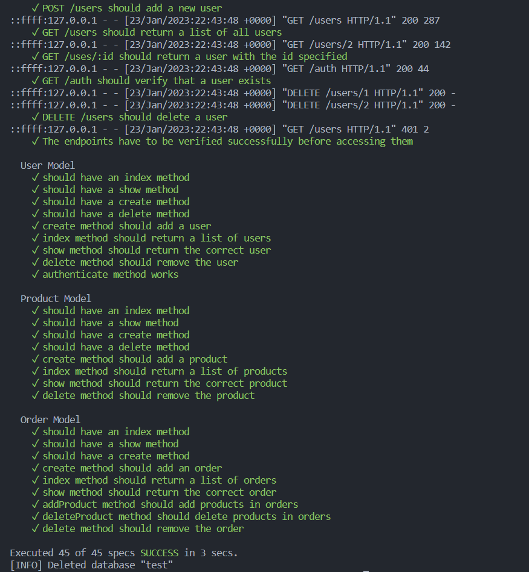

# Storefront Backend API
> ## Project two of my Udacity nano degree

## **🤯Introduction**
* This is is an API built specifically for a store. It has been built using a postgres database, using express for server-side rendering and node as the javascript run time.
* As required, the api has endpoints for:

    * Adding, viewing and deleting users, with added security for authentication and verification.
    * Adding, viewing and deleting products.
    * Adding, viewing and deleting orders.

To use the API, follow the steps below.
## **Step 1 -- Setup and configuration**

1. Run the command below to install `node_modules`.
    ```bash
    npm i
    ```
1. After the `node_modules` folder has been installed, check the `package.json` file for the dependencies and devDependencies and install them as follows.
    * You can use either `npm` or `yarn` for installation.
    * If you use `yarn` as your package installer, follow **step 1**, if you use `npm`, follow **step 2**:
        1. ### **YARN**
            Installing the dependencies
            ```bash
            yarn add bcrypt body-parser cors jasmine jasmine-spec-reporter jsonwebtoken morgan nodemon pg express dotenv db-migrate db-migrate-pg
            ```
            Installing the devDependencies

            ```bash
            yarn add --dev typescript ts-node tsc-watch prettier jasmine-ts eslint-plugin-prettier eslint-config-prettier eslint @types/node @types/bcrypt @types/body-parser @types/cors @types/express @types/jasmine @types/jsonwebtoken @types/morgan @types/nodemon @types/pg @typescript-eslint/eslint-plugin @typescript-eslint/parser
            ```
        1. ### **NPM**
            Installing the dependencies
            ```bash
            npm i bcrypt body-parser cors jasmine jasmine-spec-reporter jsonwebtoken morgan nodemon pg express dotenv db-migrate db-migrate-pg
            ```

            Installing the devDependencies
            ```bash
            npm i -D typescript ts-node tsc-watch prettier jasmine-ts eslint-plugin-prettier eslint-config-prettier eslint @types/node @types/bcrypt @types/body-parser @types/cors @types/express @types/jasmine @types/jsonwebtoken @types/morgan @types/nodemon @types/pg @typescript-eslint/eslint-plugin @typescript-eslint/parser
            ```
1. The `tsconfig.json`, `eslint.json` and `.prettierrc` are already configured for you. Don't worry about that.
1. Run the following command, this is to set up your environment variables.
    ```bash
    cp .env.example .env
    ```
    * Replace the random variables in the `.env` file with realistic values that you would use for the project, check the [database file](database.json) and copy the values for a quick set up. Modify them as you please.

1. Now to create the databases. I'll use the `database.json` file for the values. Follow along with these commands.
    ```bash
    su postgres
    ```
    After entering the command above, enter your password. Then enter the command below to be exposed to the postgres terminal.
    ```postgres
    psql postgres
    ```
    Now to set up the production database, enter these commands one at a time.
    ```postgres
    CREATE USER store_manager WITH PASSWORD 'password123';

    CREATE DATABASE store;

    \c store

    GRANT ALL PRIVILEGES ON DATABASE store TO store_manager;
    ```
    Exit by typing in `\q`, press enter, then type `psql postgres` and hit enter to get back to the postgres terminal.


    Setting up the test database
    ```postgres
    CREATE DATABASE store_test;

    \c store_test

    GRANT ALL PRIVILEGES ON DATABASE store_test TO store_manager;
    ```

    ## > That's it! You're all set up, now to have some fun with the API 😊.

## **Step 2 - Running the tests**
* This will be simple, simply run the command below and watch.
    ```bash
    npm run test
    ```
* You should see this as the results.
    

## **Step 3 - Playing around with the endpoints**
> ### This is the last step, we're almost done! 🦾

* I suggest you use [postman](https://www.postman.com/downloads/) for this step.
* First, you'll create a user to generate a unique json web token, used to add security in terms of authentication and authorization.
* Run the command below to transpile the typescript code into javascript and create a folder named `build` if not already there.
    ```bash
    npm run build
    ```
* Run either of these commands to start the server.
    ```bash
    npm run start OR node build server.js
    ```
* Open postman and create a new collection named `Storefront Backend API`.
* Hover on the collection, select the **three dots** and click **add a request**. Name the request **create user**
    
paste the link that is logged on your console. Create a user, by going to this endpoint. `/users` with the method set to **`POST`**.
* Click the body tab, select `raw` and on the drop-down list, select `JSON`.
* Paste this in the field given, and modify the values as you wish.
```json
{
    "firstName": "Test",
    "lastName": "User",
    "username": "Test User",
    "password": "password"
}
```
* Save the request and click send.
* In the response tab, a token will be produced, copy it.
* Click the collection, and head to the **Authorization** tab as seen in the picture above. 
* Select the type to be **Bearer token** and paste the token in the space given, excluding the quotes (**\"**, **\"**);

> ### Whew! You're Done!

> ### Now you can check the endpoints to test the functionality first hand! 

>> ## **Routes to try out**
| METHOD | ROUTE                                        | FUNCTION                                                     |
| :----- | --------------------------------------------:| ------------------------------------------------------------:|
| GET    | `/users`, `/orders`, `/products`             | Displays all the items in the respective routes              |
| GET    | `/users/:id`, `/orders/:id`, `/products/:id` | Displays a row in the database table specified with the `id` |
| GET    | `/auth                         `             | Authenticates the user                                       |
| POST   | `/users`, `/orders`, `/products`             | Adds values in the body tab to the database                  |
| DELETE | `/users/:id`, `/orders/:id`, `/products/:id` | Deletes a row from the database using the id in the parameter|

### **ENJOY !** 🤓