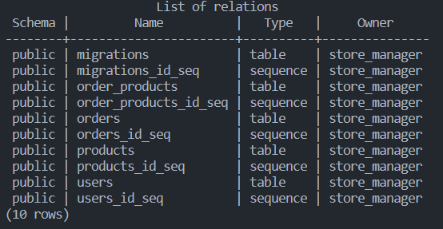
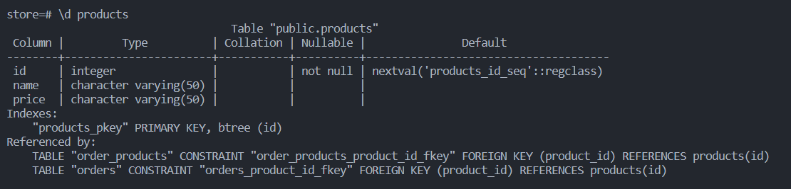
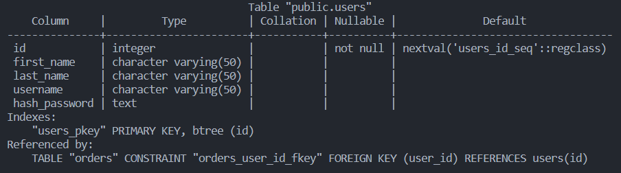
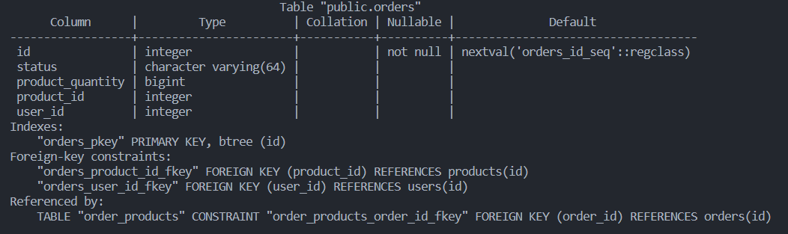
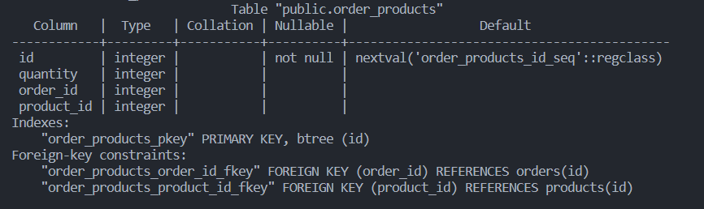

# API Requirements
The company stakeholders want to create an online storefront to showcase their great product ideas. Users need to be able to browse an index of all products, see the specifics of a single product, and add products to an order that they can view in a cart page. You have been tasked with building the API that will support this application, and your coworker is building the frontend.

These are the notes from a meeting with the frontend developer that describe what endpoints the API needs to supply, as well as data shapes the frontend and backend have agreed meet the requirements of the application. 

>>**THE DATABASE IS RUNNING ON `http://localhost:3000`**
## API Endpoints
#### Products
- Index 
- Show
- Create [token required]
- Delete [token required]
<!-- - [OPTIONAL] Products in sorted by the order id -->

#### Users
- Index [token required]
- Show [token required]
- Create N[token required]

#### Orders
- Delete [token required]
- Current Order by user (args: user id)[token required]
- All orders by users [token required]
<!-- - [OPTIONAL] All Active orders by user [token required] -->

## Data Shapes

### **Database Schema**

>## **TABLES**

#### Products

#### Users

#### Orders

### Order_products

> ## **Routes to try out**
| METHOD | ROUTE                                        | FUNCTION                                                     |
| :----- | --------------------------------------------:| ------------------------------------------------------------:|
| GET    | `/users`, `/orders`, `/products`             | Displays all the items in the respective routes              |
| GET    | `/users/:id`, `/orders/:id`, `/products/:id` | Displays a row in the database table specified with the `id` |
| GET    | `/auth`                                      | Authenticates the user                                       |
| POST   | `/users`, `/orders`, `/products`             | Adds values in the body tab to the database                  |
| DELETE | `/users/:id`, `/orders/:id`, `/products/:id` | Deletes a row from the database using the id in the parameter|
| GET    | `/products_in_orders`                        | Displays all the products in the orders sorted by the order id  |
| GET    | `/expensive_products`                        | Displays the top five most expensive orders, from most expensive|
| GET    | `/users_with_active_orders`                  | Displays all users whose orders are active                      |
| POST   | `/orders/:id/products`                       | Tracks all the products and the quantities that have their orders active|
| DELETE   | `/orders/:id/products`                       | Deletes all the products and the quantities that have their orders active, using the product id in the request body|